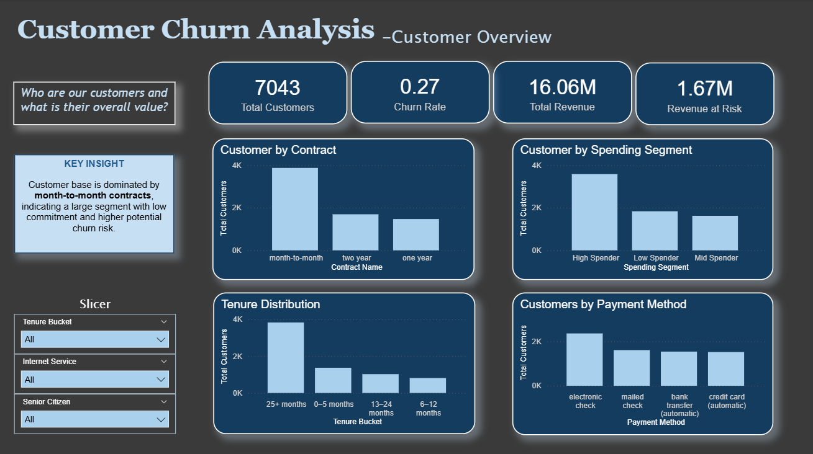
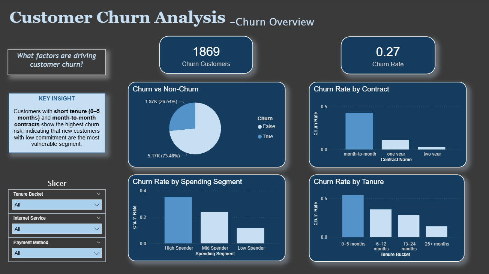
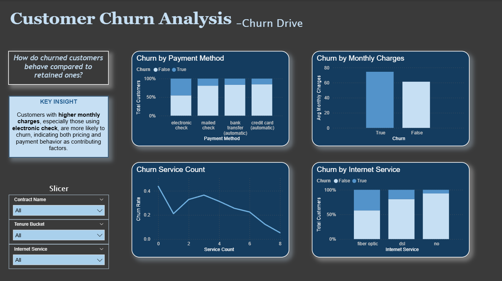
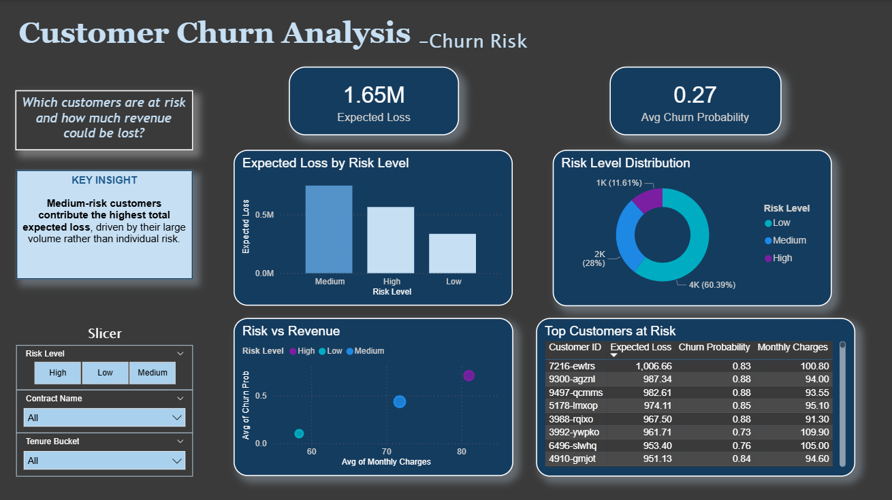
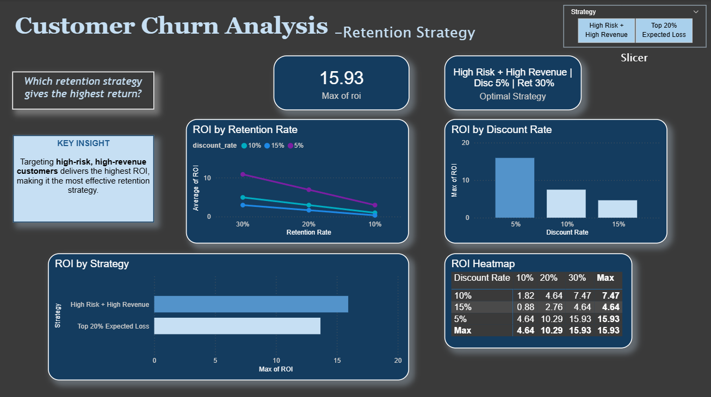

# Telco Customer Churn Analysis

## Project Overview

Customer churn is one of the main challenges in the telecommunications industry. When customers stop using a service, companies not only lose revenue but also incur additional costs to acquire new customers.

This project aims to:

* Analyze key factors that influence customer churn
* Build machine learning models to predict churn
* Estimate potential business losses due to churn
* Simulate retention strategies to maximize ROI

The dataset used is the **Telco Customer Churn Dataset**, consisting of 7,043 customers and 21 features.

### Data Source

Dataset obtained from Kaggle:
https://www.kaggle.com/datasets/blastchar/telco-customer-churn

---

# Business Objectives

1. Identify the main factors driving customer churn
2. Predict customers who are at risk of churning
3. Estimate potential revenue loss
4. Develop retention strategies that generate positive ROI

---

# Project Workflow

This project consists of several key stages:

### 1. Data Cleaning

Handling missing values and resolving data inconsistencies.

### 2. Database Design

Building a relational database using PostgreSQL with the following structure:

* customers
* billing
* services
* contract_types
* payment_methods
* internet_services

### 3. Exploratory Data Analysis (EDA)

Analysis was conducted to understand customer churn patterns.

Key insights:

* Churn rate: **26.5%**
* Customers with **month-to-month contracts** have the highest churn rate
* Customers with **low tenure are more likely to churn**
* Customers with **higher monthly charges are at greater risk of churn**

---

### 4. Customer Segmentation

Customer segmentation was performed based on:

* Tenure Bucket
* Spending Segment
* Service Usage
* Contract Risk
* Customer Lifetime Value (CLV proxy)
* Revenue at Risk

Key insights:

* **High Spenders have the highest churn rate**
* **Customers with fewer services are more likely to churn**
* **High Spenders contribute the largest share of revenue at risk**

---

### 5. Machine Learning Model

Several models were compared:

* Logistic Regression
* Random Forest
* XGBoost

Approaches to handle class imbalance:

* Baseline
* Class Weighting
* SMOTE

**Best Model:**
Random Forest

**Performance:**

* ROC-AUC: 0.844
* PR-AUC: 0.655
* Recall: 0.826

---

### 6. Business Impact Evaluation

The model was used to calculate:

* Churn Probability
* Risk Level
* Expected Financial Loss

The scored dataset is stored in the table: `churn_risk_score`

**Example Output:**

| customer_id | churn_probability | risk_level | expected_loss |
| ----------- | ----------------- | ---------- | ------------- |
| 7590-VHVEG  | 0.567             | Medium     | 203.23        |
| 5575-GNVDE  | 0.056             | Low        | 38.22         |
| 3668-QPYBK  | 0.511             | Medium     | 329.90        |
| 7795-CFOCW  | 0.044             | Low        | 22.21         |
| 9237-HQITU  | 0.621             | High       | 526.94        |

---

### 7. Retention Strategy Simulation

Simulation was conducted to evaluate the ROI of different retention strategies.

Scenarios tested:

* Discount: 5%, 10%, 15%
* Program duration: 3 months, 6 months
* Retention success rate: 10%, 20%, 30%

**Best Strategy:**

* Target: High Risk + High Revenue customers
* Discount: 5%
* Duration: 3 months

**ROI: 15.93**

**Note:**
The ROI values are based on simulation and simplified assumptions. In real-world implementation, additional operational costs and variations in customer behavior may affect the actual results.

---

## 📊 Interactive Dashboard (Power BI)

An interactive Power BI dashboard was developed to translate analytical findings and machine learning outputs into actionable business insights.

The dashboard is structured around four key business questions:

* **Who are our customers and where is the value?**
  Understand customer distribution, segmentation, and revenue contribution

* **What drives customer churn?**
  Identify key churn factors such as contract type, tenure, and spending behavior

* **Which customers are at risk and what is the potential loss?**
  Leverage churn prediction to estimate risk levels and expected revenue loss

* **Which retention strategy maximizes ROI?**
  Simulate different retention scenarios to identify the most effective strategy

**Key Insight:**
A relatively small segment of **high-risk, high-value customers** contributes disproportionately to potential revenue loss, making them the most impactful target for retention strategies.

---

## Dashboard Preview

### 1. Customer Overview



📌 Majority of customers are on **month-to-month contracts**, which also represent the highest churn risk segment.

---

### 2. Churn Overview



📌 Churn is significantly higher among customers with **low tenure and short-term contracts**.

---

### 3. Churn Drivers



📌 Customers with **higher monthly charges and fewer services** are more likely to churn.

---

### 4. Churn Risk & Revenue Impact



📌 A small group of **high-risk customers contributes the largest expected revenue loss**.

---

### 5. Retention Strategy Simulation



📌 Targeting **high-risk, high-value customers** with minimal incentives yields the highest ROI.


---

# Key Business Insights

# Key Business Insights

* The customer base is heavily dominated by **month-to-month contracts**, indicating a large segment with low commitment and higher churn risk

* Customers with **short tenure (0–5 months)** are the most vulnerable, especially when combined with **month-to-month contracts**, highlighting onboarding as a critical phase

* Customers with **higher monthly charges**, particularly those using **electronic check**, show a higher likelihood of churn, suggesting both pricing sensitivity and payment behavior as key drivers

* While high-risk customers are individually more likely to churn, the **medium-risk segment contributes the largest total expected loss** due to its larger population size

* Retention strategies targeting **high-risk, high-value customers** deliver the highest ROI, making them the most effective segment for intervention


---

# Tech Stack

Python
Pandas
Scikit-learn
XGBoost
PostgreSQL
SQLAlchemy
Seaborn & Matplotlib

---

# Project Structure

```
telco_churn_project/
│
├── data/
│   ├── raw/
│   └── processed/
│
├── notebooks/
│   ├── 01_eda.ipynb
│   ├── 02_customer_segmentation.ipynb
│   ├── 03_modelling.ipynb
│   └── 04_business_recommendation.ipynb
│
├── sql/
│   ├── 01_create_database.sql
│   ├── 02_create_tables.sql
│   └── 03_create_view_tables.sql
│
├── src/
│   ├── clean_data.py
│   └── database.py
│
├── dashboard/
│   └── telco_churn_dashboard.pbix
│
├── images/
│   ├── customer_overview.png
│   ├── churn_overview.png
│   ├── churn_drivers.png
│   ├── churn_risk.png
│   └── retention_strategy.png
│
├── requirements.txt
├── README.md
└── .gitignore
```
